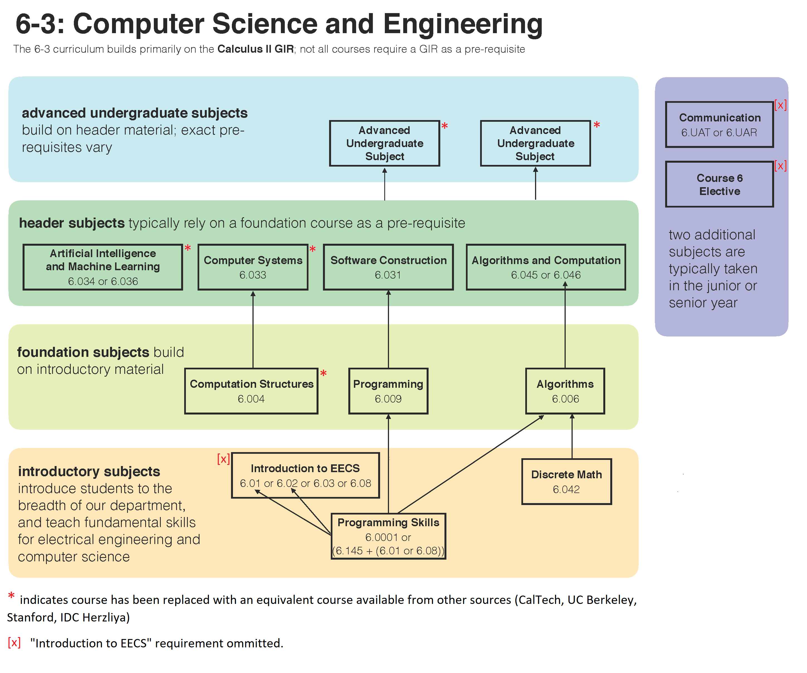

# Open-Source Computer Science Education

This project documents my personal curriculum of online, open-sourced, university-level courses that attempt to emulate the breadth and depth of an undergraduate CS degree.  

Initial inspiration came from [The Open-Source Computer Science Degree](https://github.com/ossu/computer-science) project on GitHub. My primary template was [MIT 6-3 Computer Science Degree Requirements](http://www.eecs.mit.edu/curriculum2017) and their [degree roadmap](https://www.eecs.mit.edu/docs/ug/freshman_roadmaps.pdf). A majority of requirements were satisfied directly with [MIT Open Courseware](https://ocw.mit.edu/courses/electrical-engineering-and-computer-science/) and, when available, the more interactive versions ported to edX. The remaining requirements were satisfied using courses from other institutions (UC Berkeley, Stanford, CalTech, IDC Herzliya), typically when the MIT OCW version was incomplete in it's Video Lectures, Homeworks, Tests, or Project Autograders.

Customized CS curriculum roadmap.

### Introductory Subjects

**Programming Skills**

MIT 6.0001: Introduction to Computer Science and Programming in Python

edX port of MIT OCW with Professors Eric Grimson and John Guttag.

Resource Links: [edX MITx: 6.00.1x](https://courses.edx.org/courses/course-v1:MITx+6.00.1x+2T2017_2/course/), [edX MITx: 6.00.2x](https://courses.edx.org/courses/course-v1:=MITx+6.00.2x+3T2017/course/)

>Note: [Equivalent to MIT OCW version](https://ocw.mit.edu/courses/electrical-engineering-and-computer-science/6-0001-introduction-to-computer-science-and-programming-in-python-fall-2016/#course_tabs), but with better support for autograding.

**Discrete Math**

MIT 6.042: Mathematics for Computer Science.

Fall 2010 version with Professor Thomas Leighton.

Resources: [MIT OCW](https://ocw.mit.edu/courses/electrical-engineering-and-computer-science/6-042j-mathematics-for-computer-science-fall-2010/)

### Foundation Subjects

**Computation Structures**

~~MIT 6.004 Computation Structures~~ 

Replaced with From Nand to Tetris: Building a Modern Computer from First Principles.

Coursera version with Professor Shimon Schocken.

Resources: [Nand2Tetris Part 1](https://www.coursera.org/learn/build-a-computer?), [Nand2Tetris Part 2](https://www.coursera.org/learn/nand2tetris2) 

**Programming**

~~MIT 6.009 Fundamentals of Programming~~

Ommitted. Equivalent coverage of material is found in MIT 6.031: Software Construction

**Algorithms**

MIT 6.0042: Mathematics for Computer Science.

Fall 2011 version with Professors Erik Demaine and Srini Devadas.

Resources: [MIT OCW](https://ocw.mit.edu/courses/electrical-engineering-and-computer-science/6-006-introduction-to-algorithms-fall-2011/)

### Header Subjects

**Artificial Intelligence and Machine Learning**

~~MIT 6.034: Artificial Intelligence~~

Replaced with UC Berkeley CS 188: Introduction to Artificial Intelligence

Fall 2018 version with Professors Peter Aibeel and Daniel Klein.

Resources: [CS 188 Fall 2018 Course Website](https://inst.eecs.berkeley.edu/~cs188/fa18/), [General Course Website](http://ai.berkeley.edu/home.html)

**Computer Systems (~50% remaining)**

~~MIT 6.033: Computer Systems~~

Replaced with UC Berkeley CS 162: Operating Systems and Systems Programming

Composite set of resources used between Spring 2019 course website and archived Spring 2015 lectures. 
Taught by Professor John Kubiatowicz

Resources: [CS 162 Spring 2019 Course Website](https://cs162.eecs.berkeley.edu/), [Spring 2015 Lectures archived at InfoCoBuild](http://www.infocobuild.com/education/audio-video-courses/computer-science/cs162-spring2015-berkeley.html)

**Software Construction**

MIT 6.031: Software Construction

Composite set of resources used between course website and edX versions. Taught by Professor Robert Miller

Resources: [Course Website](http://web.mit.edu/6.031/www/sp19/), [edX Version Part 1](https://courses.edx.org/courses/course-v1:MITx+6.005.1x+3T2016/course/), [edX Version Part 2](https://courses.edx.org/courses/course-v1:MITx+6.005.2x+1T2017/course/) 

**Algorithms and Computation**

MIT 6.046: Design and Analysis of Algorithms

Spring 2015 version with Professors Erik Demaine and Srini Devadas.

Resources: [MIT OCW](https://ocw.mit.edu/courses/electrical-engineering-and-computer-science/6-046j-design-and-analysis-of-algorithms-spring-2015/)

### Advanced Undergraduate Subjects

**Advanced Undergraduate Subject 1 (~50% remaining)**

UC Berkeley CS 162: Introduction to Database Systems.

Composite set of resources used between edX Edge for lectures and quizzes and course for projects and exams. 

Resources: [Course Website](https://www.cs186berkeley.net/), [edX Edge](https://edge.edx.org/courses/course-v1:EdgeBerkeley+CS186+2019_SP/course/)

**Advanced Undergraduate Subject 2 (~50% remaining)**

Stanford CS 144: Introduction to Computer Networking

Fall 2010 version with Professor Phillip Levis and Nick McKeown

Composite set of resources used between edX/Laguinta for lectures and quizzes and course website for projects and exams.

Resources: [Course Website](http://www.scs.stanford.edu/10au-cs144/), [edX Edge](https://edge.edx.org/courses/course-v1:EdgeBerkeley+CS186+2019_SP/course/), [edX / Stanford Lagunita](https://lagunita.stanford.edu/courses/Engineering/Networking-SP/SelfPaced/about)

**Advanced Undergraduate Subject 3**

CalTech CS 156: Learning Systems (Machine Learning)

Spring 2012 version with Professor Yaser Abu-Mostafa

Resources: [Open Sourced Course Website](https://work.caltech.edu/telecourse.html)
